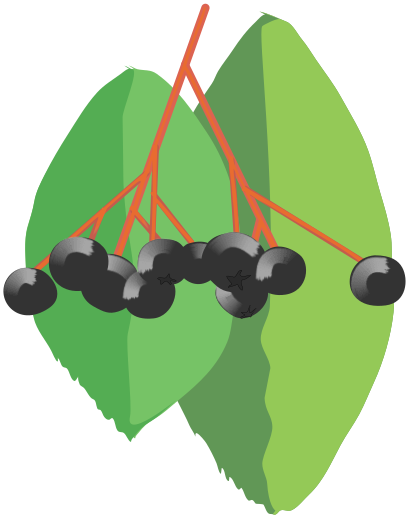

[![npm version][npm-shield]][npm-url]
[![MIT License][license-shield]][license-url]


<!-- PROJECT LOGO -->
<br />
<p align="center">
  

  <h3 align="center">RussianNounsJS</h3>

  <p align="center">
    A JavaScript library that declines nouns.
    <br />
    <br />
    <a href="https://georgy7.github.io/RussianNounsJS/">View Demo</a>
    ·
    <a href="https://georgy7.github.io/RussianNounsJS/testing.html">Run Tests</a>
    ·
    <a href="https://github.com/georgy7/RussianNounsJS/issues">Report Bug</a>
    ·
    <a href="https://github.com/georgy7/RussianNounsJS/wiki">Wiki</a>
  </p>
</p>
<br />


## Installation

### Frontend

```html
<script src="RussianNouns.js"></script>
```

or (without [AMD](https://en.wikipedia.org/wiki/Asynchronous_module_definition))

```html
<!-- from the same domain -->
<script type="module" src="myscript.js"></script>
```

```js
import 'RussianNouns.js';
```

or (in a Web Worker)

```js
importScripts('RussianNouns.js');
```

### Backend

```
npm i --save russian-nouns-js
```

```js
const RussianNouns = require('russian-nouns-js');
```

For TypeScript, there are
[type definitions](https://www.npmjs.com/package/@types/russian-nouns-js)
[written by Alexander Semin](https://github.com/RusAnonym/DefinitelyTyped/tree/master/types/russian-nouns-js).

## Usage

### The basics

```js
const rne = new RussianNouns.Engine();

// Grammatical gender is a sort of noun class, related primarily to their sound.
// Although mostly native speakers just remember them.

const Gender = RussianNouns.Gender;
const Case = RussianNouns.Case;


rne.decline({text: 'имя', gender: Gender.NEUTER}, Case.GENITIVE);
// ◂ [ "имени" ]

rne.decline({text: 'имя', gender: Gender.NEUTER}, Case.INSTRUMENTAL);
// ◂ [ "именем" ]


// A number of loan words are not declined.
// You should explicitly state this to prevent inflection.

let coat = RussianNouns.createLemma({
    text: 'пальто',
    gender: Gender.NEUTER,
    indeclinable: true
});

rne.decline(coat, Case.GENITIVE);
// ◂ [ "пальто" ]

RussianNouns.getDeclension(coat);
// ◂ -1


// Cases can be specified not only by name, but also by number.
// In the usual order: NOM, GEN, DAT, ACC, INS, PREP.
// And there is also the locative case as the seventh.
// It usually matches the prepositional one.

let mountain = RussianNouns.createLemma({
    text: 'гора',
    gender: Gender.FEMININE
});

RussianNouns.CASES.map(c => {
    return rne.decline(mountain, c);
});

// ◂ [
//     ["гора"]
//     ["горы"]
//     ["горе"]
//     ["гору"]
//     ["горой", "горою"]
//     ["горе"],
//     ["горе"]
// ]


// This is how you can get a plural form in the nominative case.

rne.pluralize(mountain);
// ◂ [ "горы" ]


// When you have the plural form in the nominative case, pass it
// as the third argument of the decline function to decline in plural.

RussianNouns.CASES.map(c => {
    return rne.decline(mountain, c, 'горы');
});

// ◂ [ 
//     [ 'горы' ]
//     [ 'гор' ]
//     [ 'горам' ]
//     [ 'горы' ]
//     [ 'горами' ]
//     [ 'горах' ]
//     [ 'горах' ]
// ]


// For words that are used only in plural, the original form
// of the word is the plural form in the nominative case.
// You should also explicitly state this.
// The concept of grammatical gender doesn't make sense for such words.

let scissors = RussianNouns.createLemma({
    text: 'ножницы',
    pluraleTantum: true
});

rne.pluralize(scissors);
// ◂ [ 'ножницы' ]

RussianNouns.CASES.map(c => {
    return rne.decline(scissors, c);
});

// ◂ [
//     [ 'ножницы' ]
//     [ 'ножниц' ]
//     [ 'ножницам' ]
//     [ 'ножницы' ]
//     [ 'ножницами' ]
//     [ 'ножницах' ]
//     [ 'ножницах' ] 
// ]
```

### A complex example

```js
const Gender = RussianNouns.Gender;
const createLemma = RussianNouns.createLemma;

const rne = new RussianNouns.Engine();

function sg(lemma, caseNumber) {
    const c = RussianNouns.CASES[caseNumber - 1];
    return rne.decline(lemma, c)[0];
}

function pl(lemma, caseNumber) {
    const c = RussianNouns.CASES[caseNumber - 1];
    const pluralForm = rne.pluralize(lemma)[0];
    return rne.decline(lemma, c, pluralForm)[0];
}

function cap(str) {
    return str[0].toUpperCase() + str.substring(1);
}


// Николай Степанович Гумилев
// Рассказ девушки (фрагмент)

const ворота = createLemma({text: 'ворота', pluraleTantum: true});
const тень = createLemma({text: 'тень', gender: Gender.FEMININE});
const снег = createLemma({text: 'снег', gender: Gender.MASCULINE});

const милая = createLemma({text: 'милая', gender: Gender.FEMININE});
const старая = createLemma({text: 'старая', gender: Gender.FEMININE});
const ель = createLemma({text: 'ель', gender: Gender.FEMININE});

const неведомая = createLemma({text: 'неведомая', gender: Gender.FEMININE});
const высота = createLemma({text: 'высота', gender: Gender.FEMININE});

console.log(`* * *
Я отдыхала у ${pl(ворота, 2)}
Под ${sg(тень, 5)} ${sg(милая, 2)}, ${sg(старая, 2)} ${sg(ель, 2)},
А надо мною пламенели
${cap(pl(снег, 1))} ${pl(неведомая, 2)} ${pl(высота, 2)}.`);

// * * *
// Я отдыхала у ворот
// Под тенью милой, старой ели,
// А надо мною пламенели
// Снега неведомых высот.
```

## Limitations

This library does not prevent you from misusing the [singularia tantum](https://en.wikipedia.org/wiki/Plurale_tantum#Singulare_tantum).

## References
- Современный русский язык. Морфология - Камынина А.А., Уч. пос. 1999 - 240 с.
- [Russian grammar (English Wikipedia)](http://en.wikipedia.org/wiki/Russian_grammar)
- [OpenCorpora (Russian text corpus)](http://opencorpora.org/)
- К семантике русского локатива ("второго предложного" падежа) - Плунгян В. А., Семиотика и информатика. - Вып. 37. - М., 2002. - С. 229-254


<!-- MARKDOWN LINKS & IMAGES -->
<!-- https://www.markdownguide.org/basic-syntax/#reference-style-links -->
[npm-shield]: https://img.shields.io/npm/v/russian-nouns-js.svg?style=for-the-badge
[npm-url]: https://www.npmjs.com/package/russian-nouns-js
[license-shield]: https://img.shields.io/github/license/georgy7/RussianNounsJS.svg?style=for-the-badge
[license-url]: https://github.com/georgy7/RussianNounsJS/blob/release/LICENSE.txt
